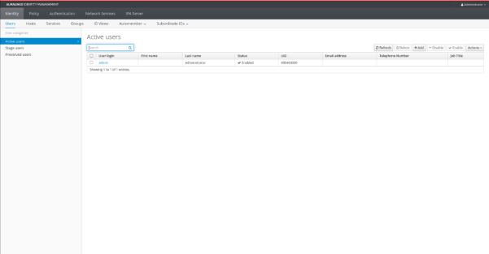

***Dockerization steps for a FreeIpa server***

Some references :

\-   <https://hub.docker.com/r/freeipa/freeipa-server>

\-   <https://github.com/freeipa/freeipa-container/issues/590>

\-   <https://github.com/freeipa/freeipa-container>

\-   <https://www.freeipa.org/page/Quick\_Start\_Guide>

**STEP 1 :**  Setup hostname

Use this command:
```
sudo hostnamectl set-hostname ipa.<a_name>. local
```

Or you can change it in a permanent way with `sudo nano /etc/hosts to add`:
```
127.0.0.1 ipa.<a_name>.local
```
**STEP 2 :** Remapping

Edit `/etc/docker/daemon.json` using “nano” to allow remapping:
```
{ 
      "userns-remap" : "user_name" 
} 
```
And then check uid using this command:    
```
docker run --rm busybox cat /proc/self/uid_map 
```
You must have this display:
```
0     100000     65536
```
Use the second value (i.e 165536) for remapping of permissions for docker (see later section).

**STEP 2 :** Server image

Pull docker:
```
docker pull freeipa/freeipa-server:almalinux-9
```

**STEP 3 :** Make ipa-data

Use this command :
```
sudo mkdir /var/lib/ipa-data
```
And change ownership to correct uid (from user remapping):     
```
sudo chown -R 100000:100000 /var/lib/ipa-data
```
**STEP 4 :** Create docker-compose.yml
```
services:
  freeipa_server:
    image: freeipa/freeipa-server:almalinux-9
    container_name: freeipa-serverofficial-container
    hostname: ipa.mcfaden.local
    environment:
      PASSWORD: Frodo123
    volumes:
      - /var/lib/ipa-data:/data:Z
    command: ipa-server-install -U -r MCFADEN.LOCAL --no-ntp
    stdin_open: true
    tty: true
    
    ports:
      - "80:80"
      - "443:443"
      - "389:389"
      - "636:636"
      - "88:88"
      - "464:464"
```

Then run your docker :
```
docker-compose up –d
```
**STEP 5:** Add users 

At least the admin user needs to be added in the docker container:
```
docker exec -it freeipa-server-container /bin/bash
```

Then use this command to add an admin: 
```
kinit admin
```
Using password `Frodo123`

**STEP 6:** Test

At last, try to connect to a browser using your server name (`ipa.<a_name>.local for example`) you must have this display: 




